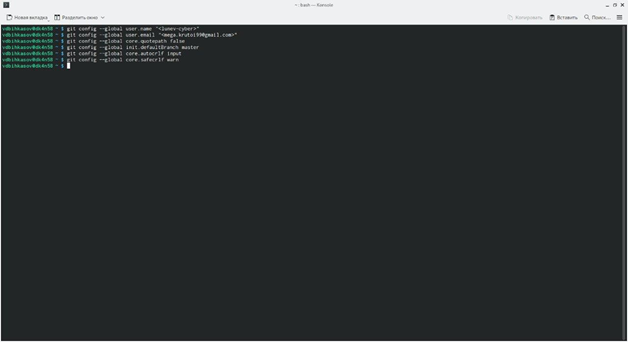
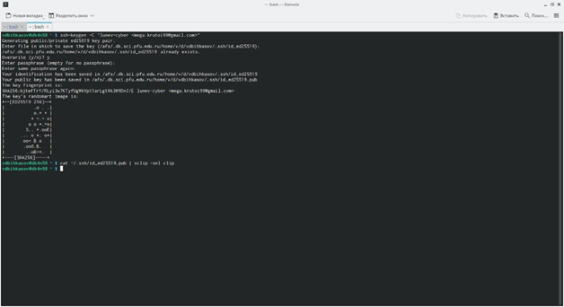
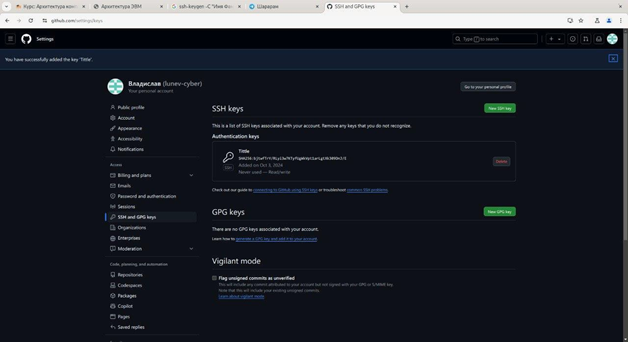
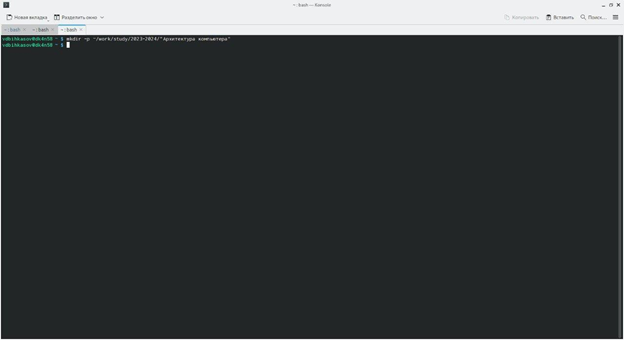
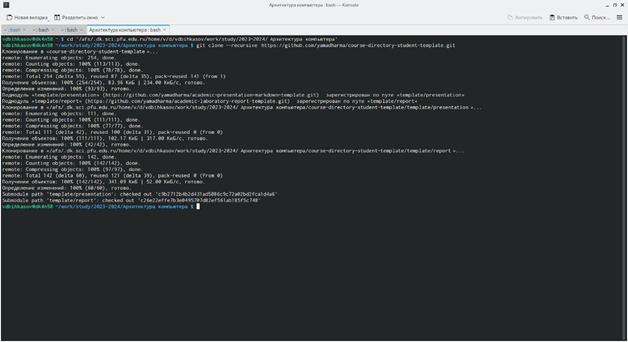
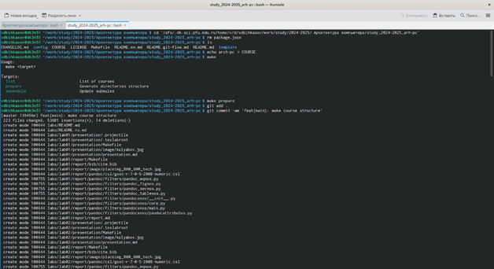
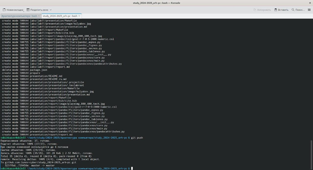

---
## Front matter
title: "Отчёт по лабораторной работе 2"
subtitle: "дисциплина:	Архитектура компьютера"
author: "Быкасов Владислав Дмитриевич НБИбд-01-24"

## Generic otions
lang: ru-RU
toc-title: "Содержание"

## Bibliography
bibliography: bib/cite.bib
csl: pandoc/csl/gost-r-7-0-5-2008-numeric.csl

## Pdf output format
toc: true # Table of contents
toc-depth: 2
lof: true # List of figures
lot: true # List of tables
fontsize: 12pt
linestretch: 1.5
papersize: a4
documentclass: scrreprt
## I18n polyglossia
polyglossia-lang:
  name: russian
  options:
	- spelling=modern
	- babelshorthands=true
polyglossia-otherlangs:
  name: english
## I18n babel
babel-lang: russian
babel-otherlangs: english
## Fonts
mainfont: PT Serif
romanfont: PT Serif
sansfont: PT Sans
monofont: PT Mono
mainfontoptions: Ligatures=TeX
romanfontoptions: Ligatures=TeX
sansfontoptions: Ligatures=TeX,Scale=MatchLowercase
monofontoptions: Scale=MatchLowercase,Scale=0.9
## Biblatex
biblatex: true
biblio-style: "gost-numeric"
biblatexoptions:
  - parentracker=true
  - backend=biber
  - hyperref=auto
  - language=auto
  - autolang=other*
  - citestyle=gost-numeric
## Pandoc-crossref LaTeX customization
figureTitle: "Рис."
tableTitle: "Таблица"
listingTitle: "Листинг"
lofTitle: "Список иллюстраций"
lotTitle: "Список таблиц"
lolTitle: "Листинги"
## Misc options
indent: true
header-includes:
  - \usepackage{indentfirst}
  - \usepackage{float} # keep figures where there are in the text
  - \floatplacement{figure}{H} # keep figures where there are in the text
---

# Цель работы

Изучить идеологию и применение систем контроля версий, приобрести практические навыки по работе с системой Git.

# Задания

1.	Подготовка технического обеспечения
-	Настройка github
-	Основная настройка git
-	Генерация SSH ключа
-	Создание рабочего пространства и репозитория курса по шаблону
-	Создание репозитория курса по шаблону
-	Настройка каталога курса

2.	Задание для самостоятельной работы В процессе выполнения лабораторной работы необходимо создать отчет в соответствующем каталоге рабочего пространства (labs>lab02>report), скопировать отчеты по предыдущим лабораторным работам в соответствующие каталоги, а затем загрузить все файлы на GitHub.

# Выполнение лабораторной работы

Моя цель в этой работе — изучить принципы и идеологию системы контроля версий Git. Я планирую научиться эффективно работать с репозиториями: создавать их, управлять версиями, фиксировать изменения, а также интегрировать их в центральное хранилище. В процессе я освою работу с ветками, научусь управлять удалёнными репозиториями

## Подготовка репозитория

После настройки учётной записи на GitHub, я выполнил предварительную конфигурацию git. В терминале я ввёл следующие команды для настройки имени пользователя и электронной почты:

git config --global user.name "lunev-cyber"

git config --global user.email "mega.krutoi99@gmail.com"

Это нужно для того, чтобы каждый мой commit был подписан моими данными.

Для корректного отображения сообщений в git я также настроил параметр utf-8, введя команду:

git config --global core.quotepath false. (рис. [-@fig:001])

{ #fig:001 width=70%, height=70% }

Для того чтобы безопасно подключаться к репозиторию, я сгенерировал SSH ключ с помощью команды:
 
ssh-keygen -C "lunev-cyber <mega.krutoi99@gmail.com>".

SSH ключ позволяет мне осуществлять безопасную аутентификацию на сервере без необходимости каждый раз вводить пароль. Полученный публичный ключ был загружен на GitHub в разделе "SSH and GPG keys".(Рис.2 и Рис.3)
(рис. [-@fig:002]) (рис. [-@fig:003])

{ #fig:002 width=70%, height=70% }

{ #fig:003 width=70%, height=70% }

Я создал рабочее пространство для лабораторной работы, следуя предложенной структуре. Каталоги были созданы с помощью команды:

mkdir -p ~/work/study/2024-2025/Архитектура компьютера/arch-pc/labs/lab02/. 

Эта структура позволяет легко управлять файлами лабораторных работ.
(рис. [-@fig:004])

{ #fig:004 width=70%, height=70% }

Для упрощения работы, я создал репозиторий на основе шаблона курса через веб- интерфейс GitHub. Я использовал готовый шаблон, который предоставил преподаватель, выбрав опцию "Use this template". Это помогло мне быстро настроить все необходимые файлы и каталоги. С помощью команды “git clone –recursive”
(рис. [-@fig:005]])

{ #fig:005 width=70%, height=70% }

Перейдя в каталог курса, я удалил ненужные файлы, с помощью команды “rm package.json”, и создал необходимые каталоги для курса, с помощью команды “make prepare”. Затем я выполнил первичную настройку структуры репозитория с помощью команд:

git add .

git commit -am "feat(main): make course structure" 

git push

Эти действия загрузили структуру курса в центральный репозиторий на GitHub.

(рис. [-@fig:006], [-@fig:007])

{ #fig:006 width=70%, height=70% }

{ #fig:007 width=70%, height=70% }

## задание для самостоятельной работы. 

Я создал отчет по выполнению лабораторной работы и сохранил его в каталоге
labs/lab02/report.
Затем скопировал отчеты по предыдущим лабораторным работам в соответствующие каталоги и загрузил их на GitHub с помощью команд:

git add .

git commit -am 'Добавлены отчеты по лабораторным работам'

git push

# Выводы

В ходе выполнения лабораторной работы я получил практические навыки работы с системой контроля версий Git. Я освоил основные команды, настроил рабочее пространство и репозиторий, а также успешно загрузил результаты на GitHub.
